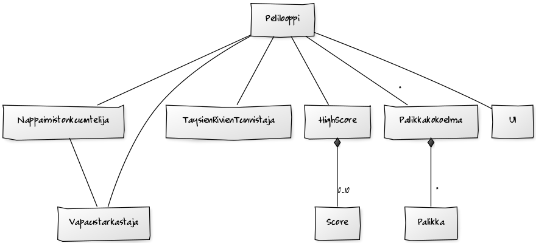
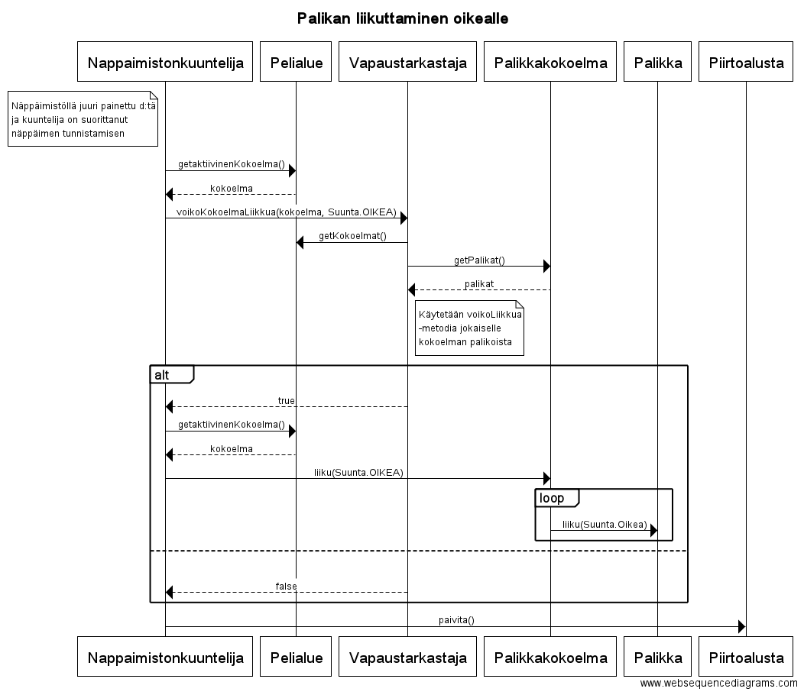
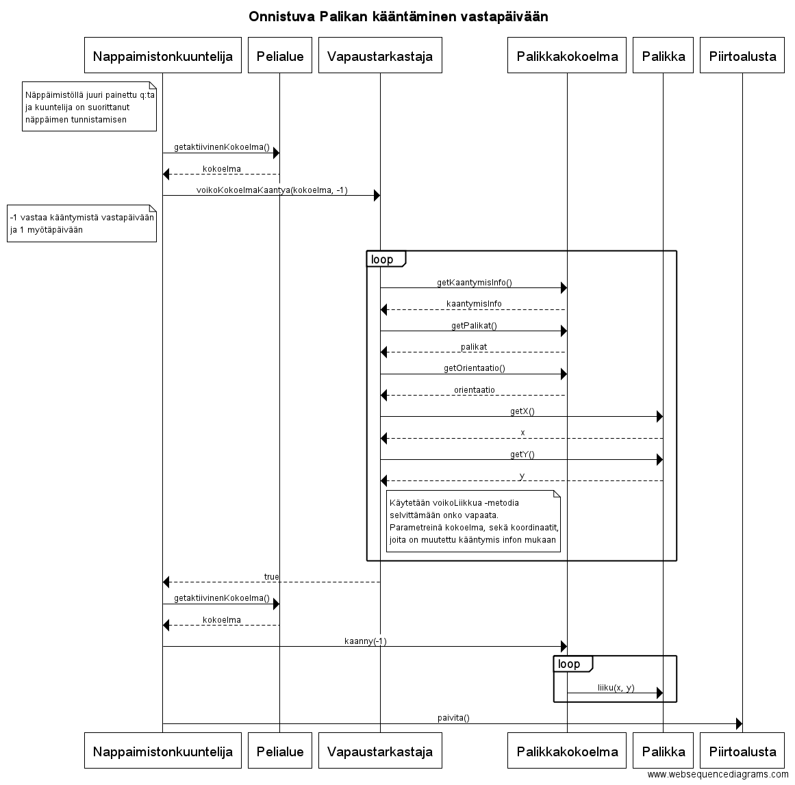

**Aihe:** Tetriksen kaltainen peli, jossa kontrolloidaan putoilevia palikoita. Tarkoituksena on siis luoda ohjelma, joka pudottelee satunnaisesti valittuja palikoita pelaajan hallittavaksi. Pelaaja tällöin pyrkii ohjaamaan ja kääntelemään palikoita siten, että putoavat palikat muodostavat täysiä rivejä pelialueen reunasta reunaan. Tällöin rivi poistetaan, jäljellä olevia palikoita liikutetaan alaspäin ja pelaajalle annetaan pisteitä (mahdollisesti myös combopisteitä useamman rivin täyttyessä samaan aikaan). Pelin häviää jos pelaajan kasaama palikkapino ylittää pelialueen ylärajan. Pelin päättyessä pelaajalta kysytään nimikirjaimia ja pistetulos tallennetaan highscorea varten.

Highscore-systeemi lisätään, jos aikaa jää.

**Käyttäjä:** Pelaaja

**Toiminnot menussa:**
- aloita peli
- katso highscoreja
- poistu

**Toiminnot pelissä:**
- liikuta palikkaa oikealle tai vasemmalle
- käännä palikkaa
- pudota palikkaa nopeammin
- luovuta

###Luokkakaavio

Selkeyden vuoksi luokkakaavioon ei ole merkitty Main-luokkaa, joka luo lähes kaikki muut luokat. Luonnin jälkeen vastuu pelistä jätetään GUI:ssa oleville napinKuuntelijoille, jotka käynnistävät PelitilanHallinnoijan kautta peliloopin ja hoitavat huipputulos toimintaa.

Itse pelin pyörimisen aikana päävastuu on Peliloopilla, joka päivittää Paivitettava-interfacen toteuttavia luokkia ja Nappaimistonkuuntelijalla, joka ottaa inputteja vastaan sekä omalta osaltaan päivittää Piirtoalustaa.

Pelaajan hallinnassa olevan kokoelman liikkuessa Nappaimistonkuuntelija ja AktiivisenKokoelmanHallinnoija varmistavat tarvittaessa luukuttelun olevan sallittua.

Täysien rivien muodostuessa TaysienRivienKasittelija tuohoaa Pelialueelta niillä olevat Palikat ja raportoi tuhotuista palikoista PisteenLaskennalle.
Lopuksi TaysienRivienKasittelija pudottaa ilmaan jääneet kokoelmat Vapaustarkastajan avulla.

Peli päättyy, kun AktiivisenKokoelmanHallinnoija tai pelaaja painaa Luovuta-nappia (NapinKuuntelija), jolloin PelitilanHallinnoija pysäyttää Peliloopin.

Huipputulostoimintoja hallitaan useilla napeilla ja popup-ikkunoilla. Huipputulokset ovat tallennettuna tiedostoon, josta ne voidaan lukea tarvittaessa.

###Sekvenssikaavioita

