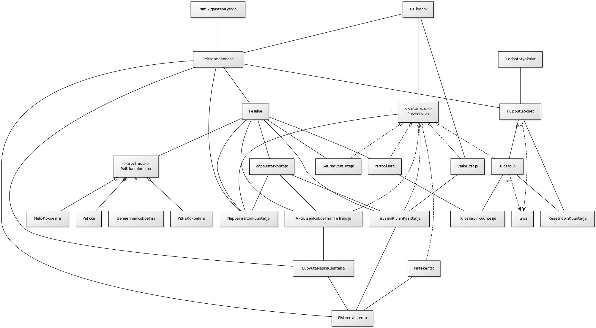

**Aihe:** Tetriksen kaltainen peli, jossa kontrolloidaan putoilevia palikoita. Tarkoituksena on siis luoda ohjelma, joka pudottelee satunnaisesti valittuja palikoita pelaajan hallittavaksi. Pelaaja tällöin pyrkii ohjaamaan ja kääntelemään palikoita siten, että putoavat palikat muodostavat täysiä rivejä pelialueen reunasta reunaan. Tällöin rivi poistetaan, jäljellä olevia palikoita liikutetaan alaspäin ja pelaajalle annetaan pisteitä (mahdollisesti myös combopisteitä useamman rivin täyttyessä samaan aikaan). Pelin häviää jos pelaajan kasaama palikkapino ylittää pelialueen ylärajan. Pelin päättyessä pelaajalta kysytään nimikirjaimia ja pistetulos tallennetaan highscorea varten.

Piste- ja menusysteemi lisätään, jos aikaa jää.

**Käyttäjä:** Pelaaja

**Toiminnot menussa:**
- aloita peli
- katso highscoreja
- poistu

**Toiminnot pelissä:**
- liikuta palikkaa oikealle tai vasemmalle
- käännä palikkaa
- pudota palikkaa nopeammin
- luovuta

###Luokkakaavio

